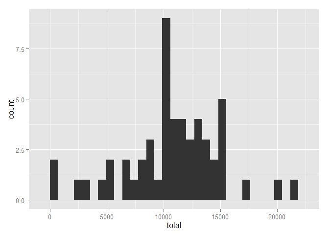
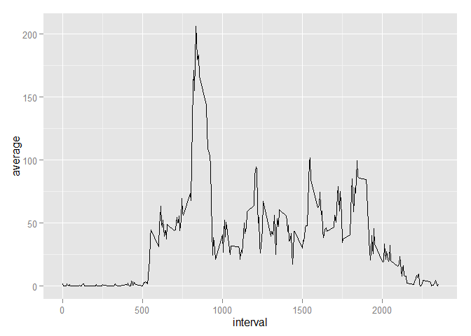
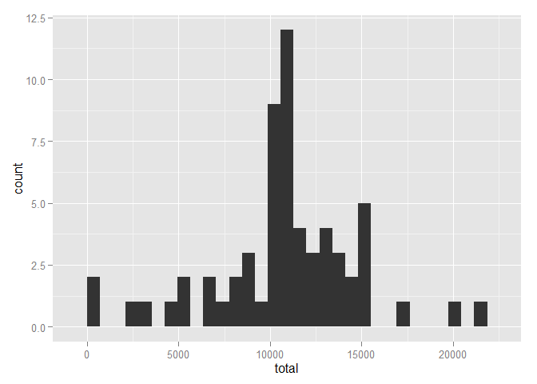

# Reproducible Research: Peer Assessment 1


## Loading and preprocessing the data
Load manipulation and plotting libraries. Read in the data and set the date column entries as Data type objects.


```r
library(dplyr); library(ggplot2)
```

```
## 
## Attaching package: 'dplyr'
## 
## The following object is masked from 'package:stats':
## 
##     filter
## 
## The following objects are masked from 'package:base':
## 
##     intersect, setdiff, setequal, union
```

```
## Warning: package 'ggplot2' was built under R version 3.1.3
```

```r
df <- read.csv("activity.csv")
df <- mutate(df, date = as.Date(date))
```

## What is mean total number of steps taken per day?

### Make a histogram of the total number of steps taken each day


```r
totalByDate <- group_by(df, date) %>% summarize(total=sum(steps))
qplot(total, data=totalByDate)
```

```
## stat_bin: binwidth defaulted to range/30. Use 'binwidth = x' to adjust this.
```

 

### Calculate and report the mean and median total number of steps taken per day


```r
meanTotalSteps <- mean(totalByDate$total, na.rm=TRUE)
medianTotalSteps <- median(totalByDate$total, na.rm=TRUE)
cbind(c("mean", "median"),
      c(meanTotalSteps, medianTotalSteps))
```

```
##      [,1]     [,2]              
## [1,] "mean"   "10766.1886792453"
## [2,] "median" "10765"
```

## What is the average daily activity pattern?

### Make a time series plot (i.e. type = "l") of the 5-minute interval (x-axis) and the average number of steps taken, averaged across all days (y-axis)


```r
meanByInt <- group_by(df, interval) %>% summarize(average=mean(steps, na.rm=TRUE))
qplot(interval, average, data=meanByInt, geom="path")
```

 

### Which 5-minute interval, on average across all the days in the dataset, contains the maximum number of steps?


```r
filter(meanByInt, average==max(average))
```

```
## Source: local data frame [1 x 2]
## 
##   interval  average
## 1      835 206.1698
```

## Imputing missing values

### Calculate and report the total number of missing values in the dataset (i.e. the total number of rows with NAs)


```r
sum(is.na(df$steps))
```

```
## [1] 2304
```

### Devise a strategy for filling in all of the missing values in the dataset. The strategy does not need to be sophisticated. For example, you could use the mean/median for that day, or the mean for that 5-minute interval, etc.

The mean for the 5-minute interval should capture the trend through out the day, which is likely stronger than the trend across different days.

### Create a new dataset that is equal to the original dataset but with the missing data filled in


```r
longMeans <- rep(meanByInt$average, length(df$steps)/length(meanByInt$average))
newDF <- df
for (i in 1:length(df$steps)) {
    if (is.na(df$steps[i])) {
        newDF$steps[i] <- longMeans[i]
    }
}
```

### Make a histogram of the total number of steps taken each day


```r
newTotalByDate <- group_by(newDF, date) %>% summarize(total=sum(steps))
qplot(total, data=newTotalByDate)
```

```
## stat_bin: binwidth defaulted to range/30. Use 'binwidth = x' to adjust this.
```

 

### Calculate and report the mean and median total number of steps taken per day.  Do these values differ from the estimates from the first part of the assignment?


```r
newMeanTotalSteps <- mean(newTotalByDate$total, na.rm=TRUE)
newMedianTotalSteps <- median(newTotalByDate$total, na.rm=TRUE)
cbind(c("", "mean", "median"),
      c("old", meanTotalSteps, medianTotalSteps),
      c("new", newMeanTotalSteps, newMedianTotalSteps))
```

```
##      [,1]     [,2]               [,3]              
## [1,] ""       "old"              "new"             
## [2,] "mean"   "10766.1886792453" "10766.1886792453"
## [3,] "median" "10765"            "10766.1886792453"
```

### What is the impact of imputing missing data on the estimates of the total daily number of steps?

The mean has not changed, but the median has moved slightly to the right, is no longer an integer, and equals the mean.

## Are there differences in activity patterns between weekdays and weekends?

### Create a new factor variable in the dataset with two levels - "weekday" and "weekend" indicating whether a given date is a weekday or weekend day


```r
newDF <- mutate(newDF, dayType = as.factor(ifelse(weekdays(date)=="Saturday"|weekdays(date)=="Sunday", "weekend", "weekday")))
```

### Make a panel plot containing a time series plot (i.e. type = "l") of the 5-minute interval (x-axis) and the average number of steps taken, averaged across all weekday days or weekend days (y-axis)


```r
plotDF <- select(newDF, -date)
plotDF <- aggregate(steps ~ ., data=plotDF, FUN=mean)
qplot(interval, steps, data=plotDF, facets=dayType~., geom="path")
```

 
